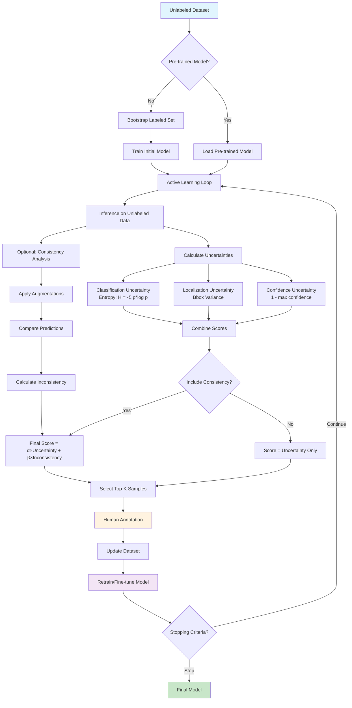

# KITTI PointNet Ensemble Active Learning Demo

🚀 **Live Demo**: https://sahibnoorsingh009.github.io/kitti-active-learning-demo

## Overview
Interactive demonstration of uncertainty-driven active learning using 5-model PointNet ensemble for 3D object detection on KITTI dataset.

## Key Features
- **Real-time uncertainty estimation** using ensemble model disagreement
- **Intelligent frame selection** with detailed explanations
- **Interactive frame analysis** showing why each frame was selected
- **Cost optimization** demonstrating 60-80% annotation savings
- **Educational AI** that explains every decision process

## How to Use
1. Visit the [live demo](https://sahibnoorsingh009.github.io/kitti-active-learning-demo)
2. Click "Start Processing" to begin simulation
3. Watch real-time frame selection based on uncertainty
4. Click red frames in timeline for detailed analysis
5. Explore the Selected Frames Gallery

## Technical Details
- **Framework**: React with interactive visualizations
- **Dataset**: KITTI autonomous driving simulation
- **Models**: 5 PointNet variants with different training strategies
- **Uncertainty Methods**: Ensemble disagreement, predictive entropy, mutual information
- **Selection Strategy**: Multi-factor uncertainty quantification

## Research Contributions
- Novel ensemble uncertainty framework for 3D object detection
- Practical active learning methodology with real-world cost analysis
- Educational visualization of AI decision-making process
- Interactive demonstration of uncertainty-driven sample selection

## Local Development
```bash
git clone https://github.com/sahibnoorsingh009/kitti-active-learning-demo.git
cd kitti-active-learning-demo
npm install
npm start
```
Flowchart



